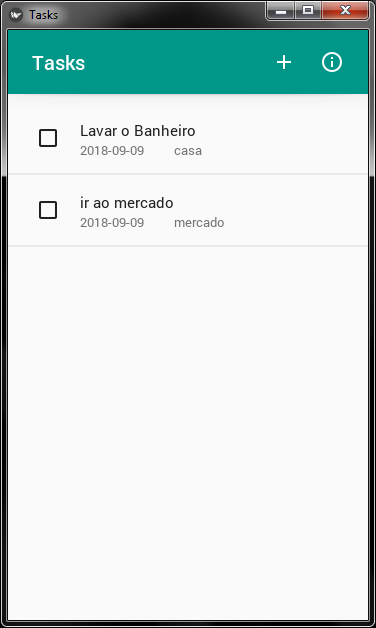
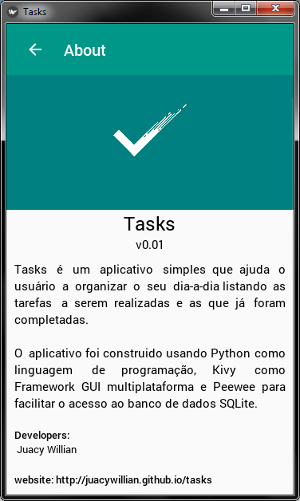

# Tasks

Tasks é um aplicativo simples que ajuda o usuário a organizar o seu dia-a-dia listando as tarefas a serem realizadas e as que já foram completadas.

O aplicativo foi construido usando Python como linguagem de programação, Kivy como Framework GUI multiplataforma, KivyMD como tema de acordo com os padrões do Material Design do Google e Peewee para facilitar o acesso ao banco de dados SQLite.

## Screenshots





## Features
* List todo tasks
* create, edit and remove tasks

## Todo
* filter tasks
* sort tasks
* hidden older completed tasks
* background task
* notification system
* user settings
* i18n support
* l10n support

## License

## Instalation

#### Kivy Install
* [Kivy Install on Windows](https://kivy.org/doc/stable/installation/installation-windows.html#installation)
* [Kivy Install on Linux](https://kivy.org/doc/stable/installation/installation-linux.html)
* [Kivy Install on MacOS](https://kivy.org/doc/stable/installation/installation-osx.html)

#### Install Requirements
###### Python 2
```
python -m pip install -r py2_requirements.txt
```

###### python 3
```
python -m pip install -r py3_requirements.txt
```

## Run application
```
python main.py
```

## Run tests
```
python -m unittest discover -v -s tests -p *test.py
```

## Links
* [Kivy]( https://github.com/kivy/kivy)
* [KivyMD](https://gitlab.com/kivymd/kivymd)
* [nose]( https://github.com/nose-devs/nose/)
* [py.test]( http://pytest.org/latest/)
